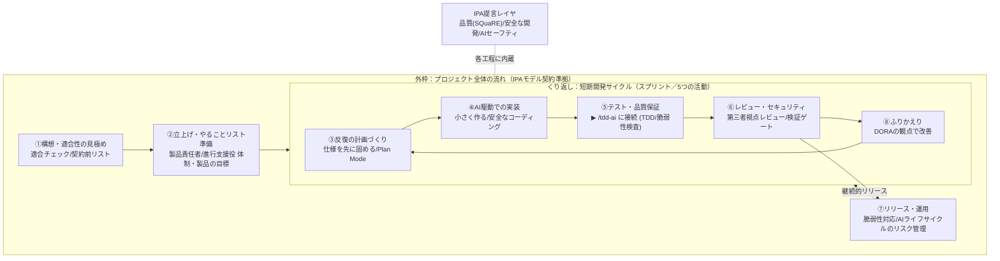

# AI駆動アジャイル開発 実践ガイド（プレイブック）

> **対象読者**：社内の開発チーム（メンバー・リード・製品責任者候補・新規参画者）
> **目的**：IPA等の公的提言を土台に、AI（生成AI・コーディングエージェント）と協働する
> 素早く柔軟な開発（アジャイル）の進め方を、チーム共通言語として体系化する。
> **体系**：ハイブリッド方式（外枠＝IPAモデル契約準拠のライフサイクル ／ 反復内＝反復型開発の進め方〔スクラム〕）。
> **用語方針**：アジャイル用語は「やさしい和訳（カタカナ用語）」で表記する（初出で併記、以降は和訳を主に使用）。
> **根拠ラベル**：各記述に `[引用]`（一次情報）／`[知識]`（確立した一般知識）／
> `[推測(確信度%)]`／`[不明]` を付す。出典は末尾「出典一覧」を参照。
>
> **このファイルの位置づけ（正・SSOT）**：本md が**正本（Single Source of Truth）**。
> HTML版（`ai-agile-manual_v1.html`）は閲覧用の派生物。内容を変えるときは**まず本md を更新**し、HTMLを追従させる。

---

## 0. 考え方（トヨタ生産方式／リーンの背骨）

アジャイル／リーン開発の源流は**トヨタ生産方式（TPS）**。本体系の各工程・ルールは、突き詰めるとこの6つの実践である。個々のやり方に迷ったら、ここへ立ち返る（用語を飾りで増やさない＝「ムダ」を出さない）。`[知識]`

1. **ムダを出さない**：作りすぎ（過剰機能／YAGNI）・大きな仕掛かり（未マージの巨大変更＝在庫）・待ち（レビュー/CI待ち）・手戻り（不良）・過剰プロセス（過剰ドキュメント）を減らす。→ ③小さく作る・just enough・WIP制限。
2. **品質を工程で作り込む（自働化）**：不良を後工程に流さない。→ ⑤テスト・⑥レビュー／検証ゲート（Hooks）・DoD で止める。
3. **問題を見える化して即止める（アンドン）**：異常を早く表面化し、すぐ助け合う。→ Draft PR・デイリー・CIの赤・ブロッカー共有。
4. **小さく改善し続ける（カイゼン）**：毎サイクル1〜3個だけ直す。犯人探しでなく仕組みを直す。→ ⑧ふりかえり。
5. **モノと情報の流れを見て、一致させる（モノと情報の流れ＝VSM）**：「要望→リリース」の作業（モノ）と状態（情報）の流れを可視化し、**滞留（待ち時間）＝最大のムダ**を潰す。チケット/ボードは実態と一致（1情報1正本・担当と着手は1箇所で見える化）。→ 重複防止・自動報告の「滞留の見える化」・DORAのリードタイム。
6. **人間性尊重（Respect for People）**：無理な締切で品質を犠牲にしない（平準化・WIP制限）。ふりかえり/ポストモーテムは**心理的安全**を守り仕組みを直す。レビューは学びと育成の場に。ナレッジを残し属人化を防ぐ。→ ⑧・形式知化・ナレッジログ。

> **AI駆動での注意**：AIは進め方を**増幅**する。弱い進め方のままAIを増やすと**ムダ・不良も増幅**される（DORA 2025）。だから「AIを足す前に、流れとムダを直す」。

---

## 0.0 クイックスタート（まず読む）

- **迷ったら進行役に任せる** → **`/agile-coach`**。最初にヒアリングして現在地を見極め、各工程スキルへ案内してくれる（オーケストレーター）。
  - **新規（ゼロから）**は①から、**既存（もう動いている）**は現状把握→欠けた所を補って③で合流（詳細は `/agile-coach` の `references/brownfield.md`）。
  - **最初に「使うツール（バージョン管理／課題管理／プロジェクト管理ボード等）」を確認**する。連携できれば**バックログ／スプリント計画の自動登録・担当の自動把握・重複防止・ふりかえり自動下書き**に活かす（API/MCPで接続。接続は許可制・認証情報は出さない。詳細は `references/tool-integration.md`）。
  - **無い役割は「用意しますか？」も確認**し、用意するなら新規セットアップを案内（人＝アカウント作成・トークン発行、AI＝git初期化・CODEOWNERS/CI・接続後の登録）。最小限（まずバージョン管理＋課題/ボード）から始める。
  - **自動報告（日次・週次・月次）の要否も最初に確認**する。必要なら 頻度→タイミング→報告先（Teams/Slack/メール/PMツール）を聞き、送信アダプタ＋スケジューラ＋初回ドライランで自動化する（設定は `templates/自動報告設定.md`、手順は `references/reporting.md`。Webhook/トークンはシークレット管理）。
  - **MCP利用の要否も確認（オプトイン＝顧客/環境が許可すれば）**。使えると加速する：Playwright（⑤⑥のE2E/動作確認）・context7（④の最新ライブラリ確認/ハルシネーション対策）・PMツール/チャット/監視（②③⑦⑧・通知）。**MCPは加速オプションで無くても全工程が回る**（フォールバック常備）。**導入前に必ず導入ゲート**（`templates/セキュリティ点検＆ツール導入ゲート.md`）＋機密3原則。詳細は `references/mcp-usage.md`。
- **新しい案件を自分で始める** → `/agile-inception`（工程①）から。
- **サイクルを回す** → `/agile-sprint-planning`（③）→ `/agile-ai-implementation`（④）→ `/tdd-ai`（⑤）→ `/agile-review-security`（⑥）→ `/agile-retrospective`（⑧）。
- **リリースする** → `/agile-review-security` 通過後に `/agile-release-ops`（⑦）。
- **迷ったら** → 後述「利用タイミング」やHTML版マニュアルの早見表を見る。
- 図（全体像）が表示されない場合は **HTML版マニュアル** を参照。

### スキル早見（呼ぶと何をするか）

| 工程 | スキル | 呼ぶと何をする？（ざっくりの動き） |
|---|---|---|
| ① | `/agile-inception` | 数問ヒアリングし、アジャイル/AI活用が向くか判定。向かなければ別の進め方を提案 |
| ② | `/agile-backlog-setup` | 役割・製品の目標・やることリストを整理し、CLAUDE.md（前提メモ）を用意 |
| ③ | `/agile-sprint-planning` | 今回の目標を決め、AIが迷わない仕様（対象/対象外/確認手順）を書き出す |
| ④ | `/agile-ai-implementation` | 技術スタックを確認し、小さく安全に実装。AI生成コードの脆弱性も自己チェック |
| ⑤ | `/tdd-ai` | 先にテストを書かせ「失敗→実装で成功」の順で品質を担保 |
| ⑥ | `/agile-review-security` | 別視点のサブエージェントで差分をレビューし、脆弱性・要件ズレを指摘 |
| ⑦ | `/agile-release-ops` | 切り戻し手段と脆弱性対応を確認し、安全にリリース・運用へ載せる |
| ⑧ | `/agile-retrospective` | 事実とAI活用を振り返り、価値KPIを測って次の改善を1〜3個決める |

### 役割ごとの主な使用スキル（誰がどれを主に使うか）

スキルは技術的には誰でも呼べる（アクセス制限はしない）。下表は**役割ごとの"主担当スキル"の案内**で、`/agile-coach` が `## この開発者` の役割を見て誘導する。実際に他人の仕事をやらない歯止めは**着手前の担当（Assignee）確認ゲート**が担う。

| 役割 | 主に使うスキル |
|---|---|
| **進行支援役（スクラムマスター／SM）** | **全スキル**（オーケストレーターとして全工程を伴走・進行・調整） |
| 製品責任者（プロダクトオーナー／PO） | ①構想（適合・KPI）／②優先順位づけ／⑥成果デモで価値確認／⑧価値測定 |
| SE（開発者） | ③仕様固め／④実装／⑤`/tdd-ai`／⑥レビュー |
| インフラ | ④環境部分／⑦リリース・運用／⑥セキュリティ点検 |
| 関係者（ステークホルダー） | 成果デモ会に参加（閲覧中心。スキルの直接操作は基本なし） |

> 役割は `## この開発者`（CLAUDE.md／②で登録）に記録。PMツール連携時は体制をツールに事前登録し、メンバー一覧から選択する。

---

## 0. このガイドの使い方とやさしい用語集

### 0.1 使い方
- 各工程の節は「**目的 / 原則 / やること / AIの使いどころ / 落とし穴**」の5要素で統一している。
- 工程①〜④・⑧は全プロジェクト共通。**⑤テスト・品質保証は必須（テーラリング対象外）**。適用強度を調整してよいのは主に**⑦リリース・運用** `[推測(80%)]`。
- 用語の和訳は**各章の初出のみカタカナ併記**し、以降は和訳のみで書く（冗長さ回避）。
- テスト工程（⑤）は専用スキル `/tdd-ai` に接続する。本ガイドは方針を示し、手順詳細は `/tdd-ai` に委ねる。

### 0.2 やさしい用語集（アジャイル用語の和訳対応表）
| やさしい和訳 | アジャイル用語 | 意味 | 出典 |
|---|---|---|---|
| 素早く柔軟な開発 | アジャイル | 計画変更を前提に試行錯誤へ適応する「適応型アプローチ」 | IPA DX SQUARE `[引用]` |
| 反復型開発の進め方 | スクラム | 短期開発サイクルで計画・開発・確認を繰り返す代表的アジャイル手法 | Scrum Guide 2020 `[引用]` |
| 短期開発サイクル | スプリント | 固定長（1ヶ月以内）の反復単位。すべての活動を含む容れ物 | Scrum Guide 2020 `[引用]` |
| 機能要望リスト | プロダクトバックログ | 作りたい機能を優先順位付けして並べたリスト | Scrum Guide 2020 `[引用]` |
| 今回やることリスト | スプリントバックログ | 今回の短期開発サイクルで取り組む作業 | Scrum Guide 2020 `[引用]` |
| 製品責任者 | プロダクトオーナー（PO） | 製品価値の最大化に責任。IPAモデルではユーザ企業が選任 | IPAモデル契約 `[引用]` |
| 進行支援役 | スクラムマスター | 進め方の確立とチームの働きやすさに責任。IPAモデルではベンダ企業が選任 | IPAモデル契約 `[引用]` |
| 動く成果物 | インクリメント | 各サイクルで作り上げる、実際に動く製品の増分 | Scrum Guide 2020 `[引用]` |
| 完成の条件 | 完成の定義（DoD） | 「これを満たせば完成」という品質の合格基準 | Scrum Guide 2020 `[引用]` |
| 製品の目標 | プロダクトゴール | 機能要望リスト全体が目指す将来像 | Scrum Guide 2020 `[引用]` |
| 今回の目標 | スプリントゴール | その短期開発サイクルで達成したい単一の狙い | Scrum Guide 2020 `[引用]` |
| 反復の計画づくり | スプリント計画 | サイクル開始時に「なぜ・何を・どうやるか」を決める会 | Scrum Guide 2020 `[引用]` |
| 毎日の短い進捗共有 | デイリースクラム | 15分で進捗を確認し計画を微調整する集まり | Scrum Guide 2020 `[引用]` |
| 成果デモ会 | スプリントレビュー | サイクルの成果を見せ、次の方向を決める会 | Scrum Guide 2020 `[引用]` |
| ふりかえり | レトロスペクティブ | 進め方の良し悪しを点検し改善を計画する会 | Scrum Guide 2020 `[引用]` |
| チームの開発速度 | ベロシティ | 1サイクルで完了できる作業量の目安 | `[知識]` |
| やることリストの整理 | リファインメント | 機能要望リストを事前に分割・明確化する作業 | `[知識]` |
| AI駆動開発 | AI駆動開発 | 生成AI・コーディングエージェントを各工程に組み込む開発スタイル | 本ガイド定義 `[知識]` |
| 増幅器 | amplifier | AIはチームの強み・弱みを増幅する。良い進め方は加速、悪い進め方は悪化 | DORA 2025 `[引用]` |

---

## 1. 全体像

**設計思想**：反復型開発の進め方（スクラム）は本来「工程を時間順に固定しない」`[引用:Scrum Guide]`。
本ガイドは反復の中身（③〜⑥⑧）を短期開発サイクルの5つの活動、外枠（①②⑦）をIPAモデル契約の
プロジェクト全体の流れとして二層で表現し、各工程にIPAの品質・セキュリティ・AIセーフティ提言を内蔵する。

---

## 1.5 PMBOK7 原則レイヤー（なぜこう進めるか）

本ガイドの8工程は「**作り方（How）**」の地図である。その土台に、PMI公式 **PMBOK Guide 第7版（2021, ANSI標準）の12原則** を「**なぜそうするか（Why）**」のレイヤーとして敷く。

> **PMBOK（ピンボック）とは？** 世界で広く使われている**プロジェクト管理の標準的な知識集**（PMI＝米国の専門機関がまとめたもの）。第7版は「こう作業せよ」という手順集から、「どんな案件にも効く**12の原則**」へ進化した `[引用:PMI公式]`。この章は、**本ガイドの8工程が世界標準の原則と噛み合っているか**を確かめるもの。英語名はそのまま載せるが、横の日本語の意味がつかめれば十分。

### 12原則 × 本ガイドの対応

「PMBOKが大事にしている12のこと」と、「本ガイドのどこでそれをやっているか」の対応。

| 原則（ざっくりの意味） | 本ガイドのどこで実践？ |
|---|---|
| ① **誠実な管理**（Stewardship）：任されたものを責任を持って扱う | ガバナンス章（下記）／AI利用の倫理・コンプライアンス `[引用]` |
| ② **協力し合うチーム**（Team）：協働できる環境をつくる | 工程②の体制・各工程のペルソナ |
| ③ **関係者を巻き込む**（Stakeholders）：先回りして関わる | 工程②体制＋⑥成果デモ会で**先回り関与・価値確認** |
| ④ **価値を大事にする**（Value）：作った量より"成果"で測る | 工程①でKPI定義・⑧で価値測定（アウトカム基準）|
| ⑤ **全体で考える**（Systems Thinking）：部分でなくつながりで見る | 体系全体（外枠×反復の二層・各工程の相互作用）|
| ⑥ **リーダーらしく**（Leadership）：役職に関係なく振る舞う | 工程②の役割・進行支援役 |
| ⑦ **やり方を調整する**（Tailoring）：状況に合わせて過不足なく | 下記「テーラリング宣言」 |
| ⑧ **品質を作り込む**（Quality）：後付けでなく最初から | 工程⑤⑥（DoD・脆弱性検査・/tdd-ai）|
| ⑨ **複雑さを乗りこなす**（Complexity）：絡まりを見極める | 工程③の不確実性洗い出し・依存の把握 |
| ⑩ **リスクに対応する**（Risk）：危険も好機も扱う | 工程③不確実性・④⑤⑥のセキュリティ |
| ⑪ **変化に強くなる**（Adaptability & Resiliency）：適応し失敗から立ち直る | 短期サイクルの反復・⑧改善・手戻り前提の小さく作る |
| ⑫ **変化を後押しする**（Change）：目指す姿への移行を支える | ⑧でAI活用の定着・進め方の見直し |

出典: PMI「12 Principles of Project Management」(©2021 PMI) `[引用]` https://www.pmi.org/-/media/pmi/documents/public/pdf/pmbok-standards/12-project-management-principles.pdf

### テーラリング宣言（PMBOK7 原則 Tailoring）

本ガイドは固定の手順書ではなく、**コンテキストに応じて"ちょうど十分（just enough）"に調整して使う** `[引用:PMI公式]`。
- 工程①〜④・⑧は全プロジェクト共通。**⑤テスト・品質保証は必須でテーラリング対象外**（品質の根幹のため省略しない）。適用強度を調整してよいのは主に**⑦リリース・運用**。
- 技術スタックは事前に固定せず、工程④で確定する（適応型）。
- 小規模・低リスク案件では工程を統合・簡略化してよい。過剰なプロセスは価値を生まない。
- **ドキュメントも"ちょうど十分"に**（増やしすぎない）。資料を作る/増やす前に、次の4問でチェック：
  1. **このドキュメントは、誰かの"決定や行動"を変えるか？**（変えないなら作らない／メモで十分）
  2. **正本は1つか？**（同じ情報を複数ファイルに持たない。「正本はこっち」の相互参照を増やさない）
  3. **二重メンテになっていないか？**（md＋htmlを両方手で直す等。片方を自動生成 or 片方に寄せる）
  4. **"空の雛形"を完成文書として数えていないか？**（中身が記入待ちなら「記入待ち」と分け、文書数を水増ししない）
  - 「足りなくて困るものだけ作る」。同一テーマの細分化（体制を6ファイルに割る等）は読み手を迷わせる→**統合**する。
  - **プロジェクト開始時に「ドキュメント方針」を決める**（汎用化のため）：各工程の成果物を**どの形式（md中心／md＋HTML／Wiki）・どこに（リポジトリ`docs/`／ツールWiki）・どこまで（必要最小限／工程ごとに指定）**残すか。`/agile-coach` が最初に確認し、`docs/agile-state.md` に記録、全工程で踏襲する。既定は「md中心・`docs/`・必要最小限」。
  - **命名規約（既定）：フォルダもファイル名も日本語・工程別**。標準フォルダ＝`docs/01_構想／02_立上げ／03_計画・設計／04_実装／05_テスト／06_レビュー／07_リリース・運用／08_ふりかえり／ナレッジ／メトリクス`。ファイル名も日本語（例：`仕様メモ_ログイン.md`・`ふりかえり_2026-07-10.md`）。**例外：`CLAUDE.md`・`CODEOWNERS`・`.github/workflows/*.yml`・ソースコードはツールが名前を固定するため英語のまま**（変えると動かない）。
  - **知見をためる系は「種別＋識別子」でユニーク命名し、ためるだけでなく"活かす"**：ふりかえり・引き継ぎ・設計判断（ADR）・ナレッジは同名で上書き衝突しないよう **日付／担当／テーマ** を付ける（例：`ふりかえり_2026-07-10.md`／`引き継ぎ_氏名_20260710.md`／`設計判断_認証_20260710.md`／領域別 `ナレッジ/領域別/<領域>.md`）。蓄積した知見は ③計画・④実装・⑥レビュー・⑧ふりかえり の**着手前に参照して再利用・同じ失敗の回避**に使う（ナレッジ蓄積系スキルがあれば「活用モード」で引き出す）。
  - **粒度は3段階から選ぶ（既定＝標準）**：

    | 粒度 | 何を残す | 向くケース |
    |---|---|---|
    | **最小** | 決定だけ（`agile-state`＋課題チケット中心、各工程mdは作らない） | 1〜少人数・短期・低リスク |
    | **標準** | 主要成果物mdのみ（①構想・③仕様・⑥レビュー・⑧ふりかえり） | 多くのチーム |
    | **詳細** | 全工程の成果物＋④設計判断ログ・メトリクス・ナレッジ | 実証・監査・経費付け替え・引き継ぎ重視 |

    工程ごとに上書き可（例：標準だが⑧だけ詳細）。
  - **形式は md 既定だが、顧客都合で Excel/Word もあり**：提出様式が指定される場合は **Excel＝`xlsx` スキル／Word＝`docx` スキル／PDF＝`pdf` スキル**で生成する。
  - **既存ドキュメントは踏襲する**：顧客・既存プロジェクトに様式（社内テンプレ・Word/Excel様式・章立て）がある場合は、**独自テンプレを押し付けず、代表サンプルを1つ読み込んで章立て・項目・粒度・形式を抽出し、それに合わせて作る**。抽出した型と参照元を `agile-state` に記録（詳細は `/agile-coach` の `references/brownfield.md`）。

### 8つの注目ポイント（パフォーマンスドメイン）の充足状況

PMBOK7が「プロジェクトで見るべき8つの観点」。本ガイドのカバー状況の自己評価（◎=十分／○=部分的）。

| 注目ポイント（意味） | 充足 | 主担当工程 |
|---|---|---|
| 進め方と工程の選び方（開発アプローチとライフサイクル） | ◎ | 体系全体 |
| 実行と価値提供（Project Work / Delivery） | ◎ | ④⑤⑥⑦ |
| 品質（Quality） | ◎ | ⑤⑥ |
| 関係者（Stakeholders） | ○ | ②⑥ |
| 計画（Planning） | ○ | ③（**スプリント計画に限定**。見積り・リリース計画・調達は範囲外）|
| 測定（Measurement） | ○ | ⑧（価値測定）|
| 不確実性（Uncertainty） | ○ | ③（**脅威中心**。機会＝オポチュニティの活用は今後）|
| チーム（Team） | ○ | ②＋各ペルソナ |

## 1.6 守るべき原則（ガバナンス／PMBOK7 Stewardship）

AIを使う以上、全工程に横串で効く原則を置く（PMBOK7原則 Stewardship＝財務・社会・技術・環境への誠実な責任）。

- **倫理・コンプライアンス**: AI事業者ガイドライン第1.1版に沿い、AIの一生（ライフサイクル）全体でリスクを認識・対策する `[引用:AI事業者ガイドライン]`。
- **広い影響への配慮（Stewardship本来の意味）**: 倫理・機密だけでなく、**コスト・社会・環境**への影響も配慮する `[引用:PMI]`。
- **機密保持の3原則**（具体・必ず守る）`[知識]`：
  1. **本番の個人情報・機密データをAI（Claude Code）に渡さない** — 開発はダミー/マスクデータで行う。
  2. **シークレット（鍵・トークン・パスワード）をコードに書かない・AIに渡さない** — Secrets Manager/SSM等で管理。
  3. **AIが触れる範囲を最小権限（IAM）で文書合意** — どこまで読める/書けるかを事前に決める。
  - 導入前に **情シス確認**（`docs/templates/情シス確認チェックリスト.md`）を通し、必要なら**情シス承認を着手ゲート(①)の条件**にする。
- **説明責任**: 出力の根拠を「引用／知識／推測／不明」で区別し、推測を断定しない（本ガイドの根拠ラベル方針）。
- **人間の最終責任**: AI生成物の出荷・意思決定の責任は人間が持つ（工程⑥）。「検証できないものは出荷しない」。

## 2. 各工程の実践

> **朝会（デイリースクラム）**：短期開発サイクル中は毎日、15分の「朝会（デイリースクラム）」で進捗を確認し計画を微調整する `[引用:Scrum Guide]`。工程③〜⑥⑧を日単位で小さく回す（詳細はHTML版マニュアル「1日・1スプリントの流れ」を参照）。

### ① 構想・適合性の見極め
- **目的**：その案件に素早く柔軟な開発（アジャイル）／AI駆動が向くかを最初に見極め、前提を揃える。
- **原則**：「やる前に向き不向きを判断する」。IPAは契約前にプロジェクト目的・関係者の理解・適合性・初期体制を点検することを求める `[引用:IPA契約前チェックリスト]`。
- **やること**：
  - 契約前チェックリストで ①目的の明確さ ②関係者が進め方を理解しているか ③対象が適合するか ④初期計画・体制 を確認 `[引用]`
  - AIを使う範囲のリスクを事前評価（生成AIの利用方針）`[引用:テキスト生成AIガイドライン]`
  - **価値・市場の裏取り**：事実と推測を分け、事実には出典を付ける。価値仮説は「誰の課題／代替手段／なぜ良いか」で軽く裏を取る `[知識]`
- **AIの使いどころ**：構想の壁打ち、競合・前例調査（事実/推測を分け出典必須）、リスク洗い出しの下書き生成、**独立検証（デビルズアドボケイト）で価値仮説・適合性を反証**（`docs/独立検証_デビルズアドボケイト.md`）。ただし意思決定は人間 `[知識]`。
- **落とし穴**：向かない案件（要件が完全固定・短期一括など）に無理にアジャイルを当てはめる `[推測(75%)]`。

### ② 立上げ・やることリスト準備
- **目的**：体制を組み、製品の目標（プロダクトゴール）とやることリスト（プロダクトバックログ）を用意する。
- **原則**：役割と責任を明確化。製品責任者（プロダクトオーナー）＝ユーザ企業、進行支援役（スクラムマスター）＝ベンダ企業、開発チーム最大10名程度 `[引用:IPAモデル契約]`。準委任契約が前提 `[引用]`。
  - ※IPAの役割定義は**外部委託**を想定。**内製（社内開発）の場合**は「ユーザ企業＝社内の事業部門」「ベンダ企業＝社内の開発チーム」と読み替える。**準委任契約の論点は社外委託時のみ**で、内製では不要。`[知識]`
- **やること**：
  - 製品の目標（プロダクトゴール）を定義し、**工程①で決めた価値・KPIと整合**させる
  - やることリスト（プロダクトバックログ）を作成し、優先順位を付ける
  - 大きめの項目は事前に「やることリストの整理（リファインメント）」で分割・明確化しておく
  - CLAUDE.md 等の永続コンテキスト（ビルド/テストコマンド・規約・作法）を整備 `[引用:Anthropic]`
- **AIの使いどころ**：機能要望項目・受入基準の下書き、ユーザーストーリーの分割案 `[引用]`。
- **落とし穴**：CLAUDE.md を盛り込みすぎると指示が無視される。「消すとAIが間違えるか？」で取捨選択 `[引用:Anthropic]`。

### ③ 反復の計画づくり（スプリント計画）
- **目的**：今回の目標（スプリントゴール）と「何を・どうやるか」を決める。
- **原則**：計画づくりは Why（今回の目標）/ What / How を扱う `[引用:Scrum Guide]`。AI時代は「仕様を先に固める（仕様駆動）」`[引用]`。
- **やること**：
  - 今回の目標（スプリントゴール）を決める。**①のKPIにどう寄与するか**を一言添える
  - 今回やることリスト（スプリントバックログ）を選ぶ
  - AIに実装させる前に仕様（関係ファイル・関数名・対象外の範囲・動作確認手順）を書く `[引用:Anthropic]`
  - Plan Mode：調べる→計画する→作る を分ける `[引用]`
  - **★予定工数を必ず入れる（予実管理の必須ルール）**：計画して起票したら、各チケットに**予定工数**（Redmineなら `estimated_hours`）を必ず登録（空起票しない）。規模→工数は換算表（既定 大8h/中4h/小2h、`agile-state.md`に記録）。**スプリント以外の計画（ロードマップ起票等）も同様**。Redmine手順は `references/redmine.md` `[知識]`
- **AIの使いどころ**：仕様の精緻化（AIに質問させて曖昧さを潰す）、計画づくりの補助 `[引用]`。
- **落とし穴**：曖昧な仕様のまま実装に渡すと「間違った問題」を高速に解く `[引用:Anthropic]`。

### ④ AI駆動での実装
- **目的**：今回やることリストを「動く成果物（インクリメント）」にする。
- **原則**：**小さく作る**（少ない行・短いタスク）とAI効果が増幅する `[引用:DORA 2025]`。安全に作り込む。
- **やること**：
  - **着手前の担当確認ゲート**：AIは自己認識（今このセッションが誰の手元か）を持たないため、放置すると他人の担当を勝手に実装して重複・衝突になる。**実装に着手する前に** ①「この開発者は誰か」（`CLAUDE.md` の `## この開発者` を読む。無ければ確認）と ②その項目の担当（Assignee）を確認する。**自分の担当ならOK、自分以外／未割当なら一旦止めて確認**（担当変更／ペア／別の自分の担当、のいずれかを選ばせる。承認なく他人の担当を実装しない）`[知識]`
  - 具体的な指示（ファイル・場面・制約・既存の書き方の参照）を与えて実装させる `[引用:Anthropic]`
  - 安全なコーディング基準として「安全なウェブサイトの作り方」11脆弱性・修正例を参照 `[引用:IPA]`
  - 生成AIコードの利用ルール（運用規程）に従う `[引用:テキスト生成AIガイドライン]`
- **AIの使いどころ**：実装の主担当。ただし下記の品質保証とレビューで必ず検証する。
- **落とし穴**：AI生成コードは**45%がOWASP Top10の脆弱性**、人間比2.7倍の脆弱性密度、約20%が存在しないパッケージを参照する `[引用:Veracode 2025/arXiv]`。「AIは安全」という思い込みは実証研究が否定 `[引用]`。

### ⑤ テスト・品質保証　▶ `/tdd-ai` へ接続
- **目的**：動く成果物が「完成の条件（完成の定義・DoD）」を満たすことを、テストと品質検査で保証する。
- **原則**：**テストを先に書く開発（TDD）はAIエージェント開発で最強パターン** `[引用:Anthropic]`。「失敗するテスト→実装で成功→整理」を徹底。AIは「失敗するテスト」を飛ばしがちなので明示する `[引用:Endor Labs/Kinde]`。
- **完成の条件（DoD）の最小例**：①機能テストが緑 ②脆弱性検査（SAST/SCA）通過 ③主要な品質特性（機能適合性・セキュリティ・使用性のうち案件で重要なもの）を満たす ④レビュー指摘の致命・要改善を解消 ⑤**形式知化**（CLAUDE.md・README・設計判断メモが更新され、他の人/AIが引き継げる）＝属人化対策。SQuaRE品質モデルはこの「どの品質特性を見るか」の選定に使う `[引用:IPAソフトウェア品質ガイド]`。
- **やること**（詳細手順は **`/tdd-ai`** に委譲）：
  - 先にテストを書く→失敗を確認→失敗テストをコミット→テストを変えず成功させる `[引用:Anthropic]`
  - SQuaRE品質モデルに基づく定量評価と「品質説明」を完成の条件（DoD）の軸にする `[引用:IPAソフトウェア品質ガイド]`
  - 脆弱性検査（SAST/SCA）を自動化のパイプラインに必須化（45%脆弱・存在しないパッケージ対策）`[引用:Veracode]`
  - AIプロダクトの場合：AIセーフティ評価10観点／攻撃的テスト（レッドチーミング）／OSS評価ツール `[引用:IPA AISI]`、機械学習要素はAIST品質ガイドライン `[引用:AIST]`
- **AIの使いどころ**：網羅的なテスト一式の自動生成（人間が省略しがちな領域）`[引用]`。
- **落とし穴**：AIが「失敗するテスト」を飛ばし「現状を追認するだけのテスト」を生成する。くり返し生成でセキュリティが劣化する現象 `[引用:arXiv 2506.11022]`。
- **接続ルール**：本工程のテスト実行・テスト先行開発（TDD）のサイクルは新規スキルを作らず `/tdd-ai` を呼び出す。本ガイドは「いつ・何を完成の条件にするか」を示し、「どう書くか」は `/tdd-ai`。

### ⑥ レビュー・セキュリティ
- **目的**：正確性・セキュリティ・要件適合を人間の責任で確認する。
- **原則**：**人間のレビュー責任は他に移せない**。「検証できないものは出荷しない」`[引用:Anthropic]`。
- **やること**：
  - 第三者視点レビュー：別の文脈/別セッションのサブエージェントに差分だけを見せて評価 `[引用:Anthropic]`
  - 観点＝正確性・想定外ケース・脆弱性・性能・既存の書き方との整合 `[引用]`
  - 自動の検証ゲート（Hooks）で 文法チェック/型チェック/テストを強制 `[引用:Anthropic]`
  - 成果デモ会（スプリントレビュー）で成果を確認し次を決める `[引用:Scrum Guide]`
- **AIの使いどころ**：一次レビュー役（第三者視点）。役割を「反証」に固定する**独立検証（デビルズアドボケイト）**＝①③⑧でも使える横断テクニック（`docs/独立検証_デビルズアドボケイト.md`）。ただし作りすぎ（過剰設計）の指摘は採用しない `[引用]`。
- **落とし穴**：レビュー役のAIは「指摘しろと言われたから」何か出す。正確性・要件のズレだけ拾う `[引用]`。

### ⑦ リリース・運用
- **目的**：継続的にリリースし、運用中のリスク・脆弱性に対応する。
- **原則**：IPAモデル契約は「最小限の製品（MVP）→第1リリース後の継続的リリース」を射程とする `[引用]`。
- **やること**：
  - 脆弱性対応プロセス（発見→対応→公表）を運用に組み込む `[引用:脆弱性対応ガイド]`
  - AIの一生（ライフサイクル）全体のリスク管理（開発者/提供者/利用者の各立場）`[引用:AI事業者ガイドライン第1.1版]`
- **AIの使いどころ**：リリースノート/変更履歴の自動生成、運用ログの一次分析 `[推測(70%)]`。
- **落とし穴**：リリース速度が上がる裏で不安定さも増す（DORA：AIは生産量と不安定さを同時に上げる）`[引用:DORA 2025]`。

### ⑧ ふりかえり（レトロスペクティブ）
- **目的**：品質と進め方を高める改善を、サイクルごとに計画する。
- **原則**：ふりかえりは最大3時間、次サイクルの改善を計画 `[引用:Scrum Guide]`。
- **やること**：
  - DORA「AIの価値を増幅する7つの能力」で自チームを点検（下記チェックリスト）`[引用:DORA 2025]`
  - 価値・KPIの達成度（アウトカム）を測る（①で定めた指標の現在地と差分）
  - チームの開発速度（ベロシティ）の傾向を見て、次サイクルの計画量の目安にする `[知識]`
  - AI活用のふりかえり（どこで効いた/事故ったか）を記録
  - **AIヒアリング方式（推奨）**：AIが各メンバーにヒアリングして下書きする。①連携ツールから各自の実績（完了/未完・工数）を把握 → ②各人に"あなた向け"の質問を3問前後 → ③短く回答（非同期可・未回収は明記） → ④共通の声と少数の重要指摘を分けて要約。**体験・判断は創作せず本人に確認／個人評価には使わない** `[知識]`
  - **保存先**：編集の正本は**リポジトリ内のmd**（docs-as-code、例 `docs/08_ふりかえり/<サイクル>.md`）。非開発者向けには**要約をツール（Wiki等）に公開**（書き込みは事前確認）`[知識]`
- **AIの使いどころ**：サイクル履歴の分析、遅れの予兆検知 `[推測(70%)]`。
- **落とし穴**：AIは増幅器。弱い進め方のままAIを増やすと問題が悪化する `[引用:DORA 2025]`。

---

## 2.9 入力→出力の具体例

> **似た表の使い分け**：いつ呼ぶか＝「スキル早見（動き）」／**何を作るか＝この入力→出力表**／会議に何を持参するか＝「2.95 持ち物＆引き継ぎ」。

各スキルが「何を材料に（入力）、何を作るか（出力）」。前工程の出力が次工程の入力になる。

| 工程 | 主な入力（材料） | 主な出力（成果物） |
|---|---|---|
| ① 構想・適合性 | 案件の概要・目的・関係者 | 適合性の判定／進む・止まる・変えるの判断／価値KPIの素案 |
| ② 立上げ | 製品の狙い・関係者・体制候補 | 体制（役割）／製品の目標／優先度付きやることリスト／CLAUDE.md雛形 |
| ③ 計画づくり | やることリスト＋今回の狙い＋メンバー一覧 | 今回の目標／**仕様メモ（対象ファイル・関数・対象外・動作確認手順）**／**スプリントボード（タスク・担当人/AI・見積り）** |
| ④ 製造（実装） | **③の仕様メモ＋技術スタック＋既存コード** | **動くコード（差分/PR）**＋安全チェック結果＋実在しない部品の排除 |
| ⑤ テスト | **③の仕様（＋④のコード）** | **テストコード＋テスト結果（緑）**＋完成の条件（DoD）充足の確認 |
| ⑥ レビュー | ④の差分＋仕様＋DoD | 指摘リスト（脆弱性・要件ズレ）＋是正済みコード／お披露目の合否 |
| ⑦ リリース | ⑥通過の成果物＋リリース方針 | リリース手順＋切り戻し手段＋脆弱性対応プロセス |
| ⑧ ふりかえり | サイクルの事実＋KPI実績＋AI活用ログ | DORA点検結果＋価値測定＋次サイクルの改善1〜3個 |

### 通し具体例：「ログイン機能」を1サイクル流す

| 工程 | 入力（こう渡す） | 出力（こう返る） |
|---|---|---|
| ③ 計画 | 「ログイン機能を追加したい」 | 目標「メール＋パスワードでログインできる」／仕様「対象=`auth/login.ts` の `login()`、対象外=パスワード再設定、確認=正資格で200・誤りで401」 |
| ④ 製造 | ③の仕様＋スタック（React/TS＋Node）＋既存コード | `login.ts` の実装差分。入力検証・SQLインジェクション対策・パスワードのハッシュ化を自己チェック済み |
| ⑤ テスト | ③の仕様（成功/失敗ケース） | `login.test.ts`（正資格→200・誤り→401・空入力→400）＋全テスト緑 |
| ⑥ レビュー | ④の差分 | 指摘「パスワードを平文でログ出力（要修正）」「エラーが具体的すぎる（軽微）」→修正して合格 |

> **ポイント**：③の「仕様メモ」が製造（④）とテスト（⑤）の**共通の材料**。③で仕様を具体的に書くほど、④⑤の出力がブレない。

## 2.95 会議の持ち物＆引き継ぎ

各工程（会議）に「何を用意して持ち込み、何を作り、それを次工程がどう読み込んで使うか」。前の成果物が次の持ち物になる。

| 工程（会議） | 事前に用意する持ち物（インプット） | この会で作る成果物 | 次の工程での使われ方 |
|---|---|---|---|
| ① 構想（キックオフ） | 案件の概要・目的・関係者リスト・（あれば）予算/期日 | 適合性の判定／価値KPIの素案／進む・止まるの判断 | ②の体制づくりの前提 |
| ② 立上げ | ①の判断結果・関係者・既存資産の情報 | 体制表／製品の目標／やることリスト／CLAUDE.md | ③の計画の材料。④以降は CLAUDE.md を読む |
| ③ 計画づくり | やることリスト・今回の狙い・対象コードの場所・メンバー一覧 | 今回の目標／**仕様メモ**／不確実性リスト／**スプリントボード（担当割り当て）** | **④が仕様メモを読み込む**。AI担当タスクは④で並列実行 |
| ④ 製造（実装） | ③の仕様メモ・技術スタック・既存コード | 動くコード（差分/PR）／安全チェック結果 | ⑤⑥が差分を読み込み検証・レビュー |
| ⑤ テスト | ③の仕様・④のコード | テストコード／テスト結果（緑） | ⑥が結果と差分を確認 |
| ⑥ レビュー（成果デモ会） | ④の差分・仕様・DoD・動くデモ・関係者 | 指摘リスト／是正済みコード／合否 | ⑦のリリース判断／⑧の材料 |
| ⑦ リリース | ⑥通過の成果物・リリース方針・切り戻し手段 | リリース手順／脆弱性対応プロセス | 次サイクルの運用前提 |
| ⑧ ふりかえり | サイクルの事実・KPI実績・AI活用ログ | DORA点検／価値測定／改善1〜3個 | **③次サイクルの計画に反映**（循環） |

> **運用のコツ（「読み込んで次工程で使う」を成立させる）**：各工程の成果物は**ファイルに残す**と次のスキルが読み込める。
> 例：③の仕様メモを `docs/03_計画・設計/ログイン機能.md` に保存 → ④で「`docs/03_計画・設計/ログイン機能.md` を読み込んで実装して」と渡す → ⑤でも同じ仕様を読んでテストする。
> 「持ち物＝前工程が残したファイル」になり、口頭の伝え漏れが減る。

### 持ち物テンプレート（記入式）

会議の持ち物は、以下のテンプレ（`docs/templates/`）を埋めるだけで用意できる。④製造・⑤テストの成果物はコード自体なのでテンプレ不要。

**入力フォーム（HTML）**：`docs/templates/template-form.html` をブラウザで開くと、入力 →「CSVに出力」で保存できる（自動保存つき）。CSVは `項目,内容` の2列でClaude Codeが読み込める。テキスト派は下の各 .md を使う。

| 工程 | テンプレ | 用途 |
|---|---|---|
| ① | `templates/00_立ち上げの10の問い.md` | キックオフで目線合わせ（インセプションデッキのやさしい版） |
| ① | `templates/00b_着手ゲート.md` | 着手のGo/No-Go判定（MUST条件が揃ったら着手） |
| ① | `templates/01_構想メモ.md` | 目的・価値KPI・適合性チェック・進む/止まる判断 |
| ガバナンス | `templates/情シス確認チェックリスト.md` | AI利用前の情シス確認（機密3原則・最小権限） |
| ② | `templates/02_立上げメモ.md` | 体制・製品の目標・やることリスト・CLAUDE.md項目 |
| ③ | `templates/03_仕様メモ.md` ★最重要 | 今回の目標・仕様・不確実性（④⑤が読み込む） |
| ③ | `templates/03b_スプリントボード.md` | タスク分解・担当割り当て（人/AI）・見積り・状態 |
| ⑥ | `templates/06_レビュー結果.md` | コア5観点＋深掘り4観点（保守性/エラー処理/依存/構成）・重要度タグ(🔴🟡🟢)・推奨アクション・ゲート確認・お披露目・合否 |
| ⑧ | `templates/08_ふりかえり.md` | 事実・AI活用・DORA点検・価値測定・改善1〜3 |
| ⑧ | `templates/メトリクス計測シート.md` | チームの調子を測る4つの数字（価値を数字で） |
| ①⑧ | `templates/KPI・OKRトラッキング.md` | 価値・KPIを OKR/KR で継続トラッキング（現在値・差分・次の一手） |
| ⑥⑦ | `templates/セキュリティ点検＆ツール導入ゲート.md` | シークレット漏洩点検・CLAUDE.md/hooks/MCP監査・新ツール導入ゲート・ゼロトラスト |
| ⑥⑧/報告 | `templates/報告書（週次・成果）.md` | 週次報告・成果/実証報告（関係者向け・数字と次の一手） |
| 運営 | `templates/議事録.md` | デイリー/レビュー/打合せの議事録（決定・To-Do・次回） |
| 報告/運営 | `templates/自動報告設定.md` | 自動報告（日次・週次・月次）の要否・タイミング・報告先・読み取り元・送信アダプタ・**1ランナー集約**・承認/安全 |
| 報告 | `templates/自動報告_レポート様式.md` | レポートの中身（**開発チーム社内向け・やさしい日本語・表/図解中心／文章は補足**）。朝会（動き・詰まり・重複衝突）／週次=反復の健康診断／月次=傾向。関係者向けは価値KPIダイジェストを派生 |
| ②③⑥ | `templates/完成の定義・着手の定義（DoD・DoR）.md` | チーム共通の完成の定義（DoD）・着手の定義（DoR）。一度決めて全スプリントで使う |
| ②⑦ | `templates/リリース計画・ロードマップ.md` | MVP→継続リリースの複数スプリント全体像（R1/R2…・狙うKPI・時期）。ローリング更新 |
| ④⑧ | `templates/ナレッジログ.md` | 知見の蓄積・活用（設計判断/つまずき/効いたプロンプト/既知課題）。キット同梱・外部スキル不要 |
| ⑧（任意） | `templates/コスト・予算 予実.md` | 受託/実証向け 工数・外部コストの予実と着地見込み |
| 進行 | `templates/agile-state.md` | 進行役の現在地・決定事項の記録 |
| 運営/⑧ | `templates/記録棚卸しチェックリスト.md` | 追記型の記録mdを定期棚卸し（3層＝先頭サマリ/本体/アーカイブ・重複統合・陳腐化削除）。検出は `examples/記録棚卸し_検出.py`。自動化はオプトイン＋終了条件 |
| 終了 | `templates/プロジェクト終了チェックリスト.md` | 完了/中止時の撤収：**自動化停止＋シークレット失効＋権限/MCP撤収＋最終アーカイブ＋引き継ぎ**（走りっぱなしを残さない） |

> 記入例（埋めた見本）：`docs/examples/` ／ 困ったとき：`docs/FAQ_よくある質問.md` ／ 自動チェックの例：`docs/examples/検証ゲートの例_Hooks.md`
> 自動報告の実サンプル（GitHub Actions×Redmine）：`docs/examples/自動報告_GitHubActions_redmine.yml.sample`＋`docs/examples/自動報告_redmine_to_chat.py.sample`（PM管理がGitHub以外でもAPIで読める／チームは1ランナーに集約）。
> 複数人でGitHub開発するときの**重複防止**：`docs/GitHub運用_重複防止ガイド.md`（Issue+担当・Draft PR・ボード・ブランチ保護・CODEOWNERS。公式ベース）。

## 3. 導入チェックリスト（工程横断・実践項目）

### 立上げ時
- [ ] 素早く柔軟な開発（アジャイル）の向き不向きを契約前チェックリストで確認した `[引用:IPA]`
- [ ] 製品責任者（ユーザ企業）・進行支援役（ベンダ）・開発チームを決めた `[引用:IPA]`
- [ ] 製品の目標（プロダクトゴール）と最初の機能要望リストがある `[引用:Scrum Guide]`
- [ ] CLAUDE.md に build/test コマンド・規約・作法を簡潔に書いた `[引用:Anthropic]`

### サイクル運用時
- [ ] 今回の目標（スプリントゴール）を言葉にした `[引用:Scrum Guide]`
- [ ] 実装前に仕様（関係ファイル/関数/対象外/確認手順）を書いた `[引用:Anthropic]`
- [ ] 小さく作っている `[引用:DORA]`
- [ ] テストを先に書いた（失敗→成功）— `/tdd-ai` で実行 `[引用:Anthropic]`
- [ ] 完成の条件（DoD）にSQuaRE品質・セキュリティ要件を含めた `[引用:IPA]`

### 品質・セキュリティゲート（マージ前必須）
- [ ] 脆弱性検査（SAST/SCA）を通過（OWASP Top10・存在しないパッケージ参照を検査）`[引用:Veracode]`
- [ ] 第三者視点レビュー（別の文脈）を実施した `[引用:Anthropic]`
- [ ] 文法/型/テストが検証ゲート（Hooks）で強制され成功している `[引用:Anthropic]`
- [ ] AIプロダクトはAIセーフティ評価10観点を確認 `[引用:IPA AISI]`

### リリース・改善
- [ ] 脆弱性対応プロセスを運用に組み込んだ `[引用:IPA]`
- [ ] ふりかえりでDORA 7つの能力を点検した `[引用:DORA]`

---

## 4. IPA提言 × 各工程 マッピング表

| 工程 | 紐づくIPA（等公的）提言 | 出典 | ラベル |
|---|---|---|---|
| ①構想・適合性 | 契約前チェックリスト／適合性判断 | [モデル契約](https://www.ipa.go.jp/digital/model/agile20200331.html) | `[引用]` |
| ②立上げ・体制 | 製品責任者/進行支援役/開発チームの役割・準委任契約 | モデル契約 | `[引用]` |
| ②③ 戦略位置づけ | DX動向2025（内製/アジャイル/AI利活用） | [DX動向2025](https://www.ipa.go.jp/digital/chousa/dx-trend/dx-trend-2025.html) | `[引用]` |
| ③計画/仕様 | （AI実践知：仕様を先に固める・Plan Mode） | [Anthropic](https://www.anthropic.com/engineering/claude-code-best-practices) | `[引用]` |
| ④実装 | 安全なウェブサイトの作り方（11脆弱性/修正例）／生成AI利用ルール | [安全なWeb](https://www.ipa.go.jp/security/vuln/websecurity/about.html)／[生成AIガイドライン](https://www.ipa.go.jp/jinzai/ics/core_human_resource/final_project/2024/generative-ai-guideline.html) | `[引用]` |
| ⑤テスト/品質 | つながる世界のソフトウェア品質ガイド（SQuaRE/品質説明） | [品質ガイド](https://www.ipa.go.jp/archive/publish/tn20150529.html) | `[引用]` |
| ⑤AI品質 | AIセーフティ評価観点/攻撃的テスト／機械学習品質(AIST) | [AISI](https://www.ipa.go.jp/pressrelease/2025/press20250402.html)／[AIST](https://www.digiarc.aist.go.jp/publication/aiqm/guideline-rev4.html) | `[引用]` |
| ⑥レビュー/セキュリティ | （AI実践知：第三者視点レビュー/検証ゲート） | Anthropic／Veracode | `[引用]` |
| ⑦リリース/運用 | 脆弱性対応ガイド／AI事業者ガイドライン第1.1版 | [脆弱性対応](https://www.ipa.go.jp/security/todokede/vuln/ug65p90000019gda-att/000089537.pdf)／[AI事業者GL](https://www.soumu.go.jp/main_content/001002576.pdf) | `[引用]` |
| ⑧ふりかえり | （AI実践知：DORA 7つの能力） | [DORA 2025](https://dora.dev/dora-report-2025/) | `[引用]` |

---

## 5. 出典一覧

### IPA・公的機関（一次情報）
1. 情報システム・モデル取引・契約書（アジャイル開発版）, IPA, 2020/初版・2025更新 — https://www.ipa.go.jp/digital/model/agile20200331.html `[引用]`
2. DX動向2025, IPA, 2025 — https://www.ipa.go.jp/digital/chousa/dx-trend/dx-trend-2025.html `[引用]`
3. DX白書2023, IPA, 2023 — https://www.ipa.go.jp/publish/wp-dx/dx-2023.html `[引用]`
4. つながる世界のソフトウェア品質ガイド（SQuaRE）, IPA/SEC, 2015 — https://www.ipa.go.jp/archive/publish/tn20150529.html `[引用]`
5. 安全なウェブサイトの作り方 改訂第7版, IPA, 2021 — https://www.ipa.go.jp/security/vuln/websecurity/about.html `[引用]`
6. 企業ウェブサイトのための脆弱性対応ガイド, IPA, 2021 — https://www.ipa.go.jp/security/todokede/vuln/ug65p90000019gda-att/000089537.pdf `[引用]`
7. テキスト生成AIの導入・運用ガイドライン, IPA, 2024 — https://www.ipa.go.jp/jinzai/ics/core_human_resource/final_project/2024/generative-ai-guideline.html `[引用]`
8. AIセーフティに関する評価観点ガイド／攻撃的テスト（レッドチーミング）手法ガイド（改訂）, IPA/AISI, 2024–2025 — https://www.ipa.go.jp/pressrelease/2025/press20250402.html `[引用]`
9. AI事業者ガイドライン 第1.1版, 総務省・経産省（IPA関与）, 2025 — https://www.soumu.go.jp/main_content/001002576.pdf `[引用]`
10. 機械学習品質マネジメントガイドライン 第4版, **AIST（産総研）**, 2023 — https://www.digiarc.aist.go.jp/publication/aiqm/guideline-rev4.html `[引用]`
11. ITSS+ アジャイル領域（進め方・宣言の読みとき方・実践ガイドブック 等）, IPA — https://www.ipa.go.jp/jinzai/skill-standard/plus-it-ui/itssplus/agile.html `[引用]`（一部PDFは暗号化のため本文未検証 `[不明]`）

### アジャイル標準・AI実践知
12. The 2020 Scrum Guide™, Schwaber & Sutherland, 2020 — https://scrumguides.org/scrum-guide.html `[引用]`
13. Best practices for Claude Code, Anthropic, 2025–2026 — https://www.anthropic.com/engineering/claude-code-best-practices `[引用]`
14. State of AI-assisted Software Development 2025（増幅器/7つの能力）, DORA/Google, 2025 — https://dora.dev/dora-report-2025/ `[引用]`
15. GenAI Code Security Report（45%脆弱）, Veracode, 2025 — https://www.veracode.com/blog/genai-code-security-report/ `[引用]`
16. Security Degradation in Iterative AI Code Generation, arXiv:2506.11022, 2025 — https://arxiv.org/pdf/2506.11022 `[引用]`
17. Test-First Prompting for Secure AI-Generated Code, Endor Labs, 2025 — https://www.endorlabs.com/learn/test-first-prompting-using-tdd-for-secure-ai-generated-code `[引用]`

### プロジェクトマネジメント標準（PMI公式）
18. 12 Principles of Project Management（PMBOK Guide 第7版 付随）, PMI, 2021 — https://www.pmi.org/-/media/pmi/documents/public/pdf/pmbok-standards/12-project-management-principles.pdf `[引用]`
19. PMBOK Guide – Seventh Edition FAQs（開発アプローチ・テーラリング・MMA）, PMI, 2021 — https://www.pmi.org/-/media/pmi/documents/public/pdf/pmbok-standards/pmbok-guide-public-faqs-1-july-2021.pdf `[引用]`
20. PMBOK Guide 標準ページ, PMI — https://www.pmi.org/standards/pmbok `[引用]`（8パフォーマンスドメインの逐語名称は一部 `[推測(95%)]`、PMI許諾の概説資料で確認）

### 注記
- 定量値（PR75%短縮・生産性25–30%・開発者信頼29%）は二次情報由来 `[推測(65–70%)]`。
- IPAのアジャイル進め方PDF・実践ガイドブック等は暗号化により本文全文は未検証。タイトル・公開年・概要はHTML公式ページで確認済み `[引用/一部不明]`。

---

## 付録：スキルとしての実装
本ガイドの工程①〜⑧は、それぞれ Claude Code Skill として実装されている（`.claude/skills/agile-*`）。
テスト工程（⑤）は既存 `/tdd-ai` に接続し、新規スキルは作らない。
用語はすべて「やさしい和訳（カタカナ用語）」で統一する。
